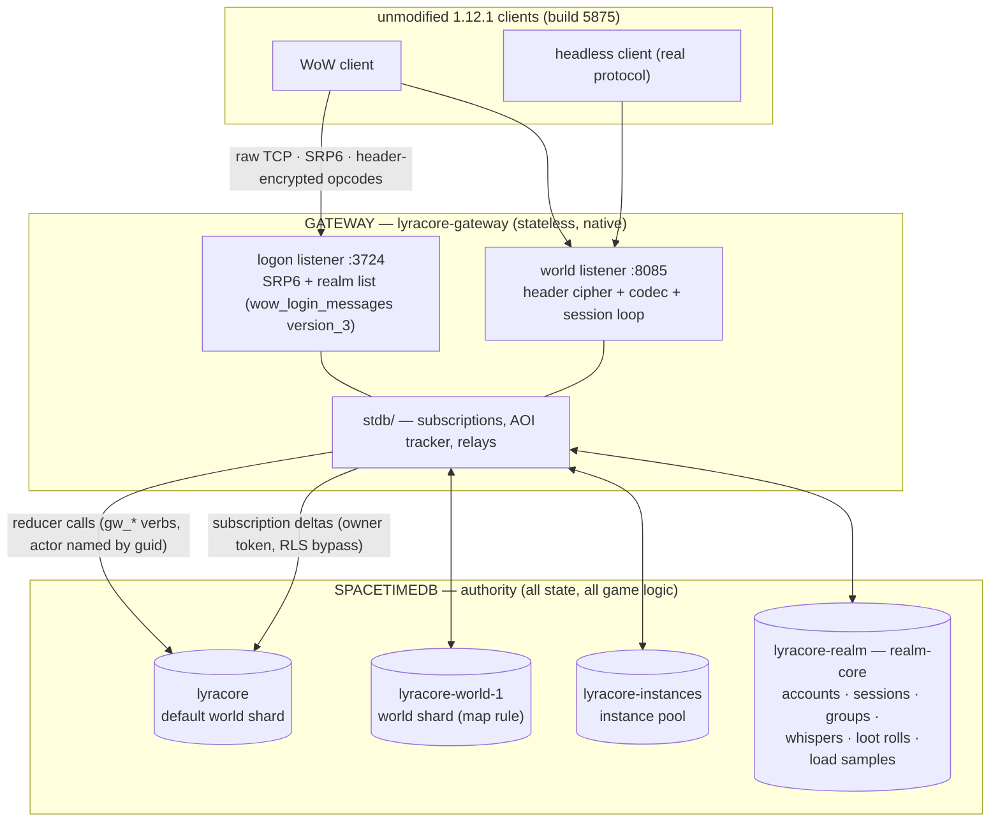

# LyraCore architecture

**Status:** current — verified against the tree on 2026-08-04. Every claim below cites the file
that makes it true; where an older document disagreed with the code, the code won.

**Authority note:** [`danger-zones.md`](./danger-zones.md) is authoritative over this document and
over every other document in this directory for anything about migrations, publishing, or the
deploy/verify procedure. This page explains *what the system is*; `danger-zones.md` tells you *what
will bite you*.

---

## 1. The shape of the system in one page

LyraCore serves **unmodified World of Warcraft 1.12.1 clients (build 5875)**. It is two tiers and
one rule.

| Tier | What it is | What it owns |
|---|---|---|
| **SpacetimeDB module** (`module/`, crate `lyracore-module`, compiles to wasm) | Relational tables + reducers | **All durable game state and essentially all game logic.** |
| **Gateway** (`gateway/`, crate + binary `lyracore-gateway`, native) | The 1.12.1 wire protocol, both listeners, the SpacetimeDB client | **No durable game state.** Protocol framing, ciphers, codecs, routing, and the cross-database gates the module structurally cannot answer. |

The rule: **a client never speaks SpacetimeDB.** A 1.12.1 client speaks SRP6 + TCP + WoW opcodes,
so the gateway is the only legitimate SpacetimeDB client, and every mutation the world can undergo
is a reducer call.



Four databases, one gateway tier, one wasm.

The same wasm is published to **every** database. A shard is a database *name*, which is a gateway
routing fact; module game logic never reads one, and an architecture test fails the build if it starts to
(`no_module_game_logic_reads_a_shard_id` in `module/src/tripwires.rs`).

---

## 2. What runs where — the authority boundary, precisely

### 2.1 The module owns

- **Every durable table** — 176 `#[table]` declarations (167 in the core module, plus 9
  contributed by in-tree extension packages), of which 109 are `public` and 67 private. Full
  inventory is covered in depth in the maintainers' internal docs; §4 below is the summary.
- **Every state transition** — 240 `#[reducer]` functions in the core module (116 of them in a
  default build, the rest behind the `debug_reducers` feature), plus more from any installed
  extension package.
- **All periodic work** — 12 scheduled tables drive combat swings, creature AI, aura ticks, ground
  areas, instance reaping, transfer reaping, and event GC. Nothing on a gateway timer decides
  gameplay.
- **All authorization of writes** — a reducer derives its actor from `ctx.sender`.

### 2.2 The gateway owns

- **Socket IO and protocol state only.** Per-connection: the SRP6 scratch, the header-cipher
  counters, the current character guid, the set of guids already `CREATE_OBJECT`'d to this client,
  the issued server seed. All of it is reconstructable on reconnect; none of it is game state.
- **Encoding and decoding.** `wow_login_messages` (`version_3` for 5875) on the logon port,
  `wow_world_messages::vanilla` on the world port, plus one hand-rolled UpdateMask encoder where
  gtker 0.3's builder walls the descriptor setters.
- **Routing across databases.** Which database owns this position, which database holds this
  character, and the seven-step transfer driver. See §6.
- **The subscription plane** — the AOI tracker and every `on_insert` relay that turns a table delta
  into an SMSG. See §5.

### 2.3 The honest exception: gates that live in the gateway

The slogan "no game logic in the gateway" is true of *state*, and very nearly true of *logic* — but
not perfectly, and the exceptions are structural rather than accidental. A module reducer runs
inside one database and cannot read another. So a handful of gates that are logically module rules
are answered by the gateway, which is the only component that can see the whole realm:

| Gate | Why it cannot live in the module | Where |
|---|---|---|
| "does this character exist" / "is this character online" for party invites | realm-core holds no characters and no live entities; one world shard sees only its own | `gateway/src/world/party.rs` (`presence`, `live_anywhere`) |
| whisper target resolution by name, realm-wide, plus the ignore verdict | same | `party.rs` (`resolve_by_name`), `gateway/src/world/whisper.rs` (`ignored_anywhere`) |
| `CMSG_NAME_QUERY` resolution | same | `party.rs` (`character_anywhere`) |
| loot-roll promotion and settlement fan-out across shards | a kill's transaction cannot reach realm-core | `gateway/src/world/loot.rs` |

Each of these re-implements *the read the module gate performed*, not a new rule, and each returns
the module's own error strings so the client sees identical behaviour on a single-database
deployment. The rationale is recorded in the maintainers' internal security analysis.

---

## 3. The realm is several databases

### 3.1 Today's topology

The realm runs as **four SpacetimeDB databases** behind one gateway tier:

| Database | Role |
|---|---|
| `lyracore` | default database + world shard |
| `lyracore-world-1` | world shard (map 1, Kalimdor) |
| `lyracore-instances` | instance pool (map 36 / Deadmines and friends) |
| `lyracore-realm` | realm-core: accounts, sessions, groups, whispers, loot rolls, load samples |

The **local developer fixture has one database per tier above** (#108) — `lyracore`,
`lyracore-kalimdor`, `lyracore-instances`, `lyracore-realm` — brought up by `./lyracore dev up`;
`dev up --single` collapses it to one. Only the second-continent shard is renamed
(`lyracore-kalimdor`, one shard where production has a growing set); the other three names are
production's own. What keeps a fixture off a production node is the **node** it is published to —
every `dev` publish is `-s local`, against the SpacetimeDB on loopback:3000 that `dev up` starts —
never the name. See [`development-cli.md`](./development-cli.md) §"Sharded out of the box, on
purpose".

**Direction:** the **region tier** — sub-map seams, the seam menu, region→shard assignments, warm
mid-walk handoff — was **removed 2026-08-08 (#471)**, an operator decision to keep the alpha on the
broad splits above (continents, the instance pool, realm-core) and nothing finer. The design is
preserved in [`region-sharding.md`](./region-sharding.md) (retired), and the two region tables stay
in the module schema, unused, because dropping a table is a destructive migration.

⚠ **All four databases run on one SpacetimeDB node, and that is a licensing constraint as well as a
deployment fact.** Seven `spacetimedb-*` crates are BSL-1.1, whose Additional Use Grant permits
production use with "no more than one SpacetimeDB instance". Four *databases* on one *instance* stays
inside it. Standing up additional SpacetimeDB instances to scale past one node — or running the
module on behalf of third parties — falls outside that reading and needs a fresh licence review
before it ships.

### 3.2 The configuration is entirely environment variables, and they fail silently

This is the single sharpest edge in operating LyraCore. The topology lives nowhere but the
gateway's environment. Omit one and you get a **working-looking single-database gateway**.

| Variable | Controls | Default if unset | Failure mode |
|---|---|---|---|
| `LYRACORE_SHARD_MAP` | `(map, bucket) → database` routing rules | `""` → one database | **Silent.** No Kalimdor, no instance pool. |
| `LYRACORE_SHARD_MAP_FILE` | file fallback for the above (the env var wins) | unset | unreadable file logs an error, then single shard |
| `LYRACORE_REALM_CORE` | the auth / session / character-index database | `None` | **Silent.** Auth, parties and whispers fall back to the world database. |
| `LYRACORE_COORDINATOR_TOKEN` | the owner token the coordinator connects with | `None` → anonymous | warns, then cannot read `game_account` / `game_session` |
| `LYRACORE_DATABASE` | default / home database name | `lyracore` | **Silent.** A wrong name connects cleanly to the wrong place. |
| `LYRACORE_SPACETIMEDB_URL` | node URI, also the base for `/v1/metrics` | `http://127.0.0.1:3000` | loud (connect fails) |
| `LYRACORE_LOGON_BIND` / `LYRACORE_WORLD_BIND` | listener binds | `0.0.0.0:3724` / `0.0.0.0:8085` | loud |
| `LYRACORE_AOI` | AOI-scoped subscriptions | **on** (`=0` disables) | — |
| `LYRACORE_QUEST_LOG` | quest-log descriptor fields | **on** | — |
| `LYRACORE_MAX_SESSIONS` / `LYRACORE_ADMIT_CONCURRENCY` | login-queue seat ceiling / admissions per tick — **per gateway PROCESS, not realm-wide** (#309): each gateway's `Mutex<State>` counts only its own seats, so `N` gateways at `LYRACORE_MAX_SESSIONS=500` admit `500*N` sessions realm-wide, and `QUEUESTAT` depth is per-gateway too. That is intentional — the cap guards *that process's* egress, a real per-process resource — but the storm the queue exists to survive (#180) is a **writer** problem shared by every gateway, so a realm running several gateways must divide its intended realm-wide ceiling by the gateway count when setting this per-process value | `0` = unlimited | a malformed value silently unlimits; an under-divided value lets N gateways reproduce the #180 writer storm while each believes it is within cap |
| `LYRACORE_MAX_BLOCKING_THREADS` | tokio blocking-pool cap — **the real ceiling on concurrent players** (see below) | `512` (tokio's own default) | malformed **or zero** falls back to `512`; the resolved value is logged at startup |
| `LYRACORE_LOAD_SAMPLE_SECS` | shard load sampling cadence | `30` | — |
| `LYRACORE_METRICS_DB_IDS` | `<shard>=<hex-identity-prefix>` map for `/v1/metrics` | `""` | warns loudly at startup; occupancy unmeasured |
| `LYRACORE_WRITER_TRACE` | per-session writer black-box ring | off | — |
| `LYRACORE_TRANSFER_ABORT_AFTER` | crash-injection harness (aborts a named transfer step) | unset | an unknown step name logs an error and nothing fires |
| `LYRACORE_PROFILE_SECS` | `--features dhat-heap` builds only | `120` | — |

Two non-`LYRACORE_` variables matter: `RUST_LOG` (consumed by `env_logger` in `gateway/src/main.rs`)
and `MALLOC_ARENA_MAX` (glibc, not the binary — worth ~4× RSS per connection).

### `LYRACORE_MAX_BLOCKING_THREADS`, and the two limits above it (#451)

Both listeners hand every accepted socket to `spawn_blocking` — the `wow_login_messages` /
`wow_world_messages` codecs are blocking `std::io` — and a **world session holds its blocking thread
for the session's entire life**. So the blocking-pool cap *is* the seat count, shared between live
world sessions and in-flight logon handshakes. It was tokio's inherited default of 512 until #451,
configured by nothing and reported by nothing.

That mattered because a full pool does not refuse: `spawn_blocking` **queues**, so the socket is
accepted at TCP level and then never handshaked — indistinguishable from "the server is full" and
invisible in the log. Measured 2026-08-07 on an 8-core/15 GB container, 600 clients offered:

| `max_blocking_threads` | seated | failed |
|---|---|---|
| 512 (tokio default) | 477 | 123 |
| 4096 | 535 | 65 |

477 rather than a clean 512 because logon handshakes draw from the same pool. Raising it is worth
about 58 sessions on that host. (The next ceiling this section used to name — per-player
connection setup — is gone with the per-player connections themselves, #483.)

Two related startup behaviours have no environment variable, because there is no case for turning
them off:

- **`RLIMIT_NOFILE` soft is raised to hard** before the runtime is built (`gateway/src/fd_limit.rs`).
  A stock Docker container is soft 1024 / hard 524288, and #447 died at ~200 sessions with
  `Too many open files (os error 24)` against 512× of unclaimed headroom. A live session costs 3–5
  descriptors. Failure logs and continues — it never blocks startup.
- **A transient `accept(2)` errno costs one connection, not the realm** (`gateway/src/accept.rs`).
  `EMFILE`, `ENFILE`, `ECONNABORTED`, `EINTR`, `ENOBUFS`, `ENOMEM` and every unenumerated errno are
  logged and skipped, with a backoff that settles at one attempt per second under sustained
  pressure; only `EBADF` / `ENOTSOCK` / `EINVAL` / `EFAULT` — the listener itself being unusable —
  end the task. Previously any non-`WouldBlock` errno propagated through `try_join!` and ended the
  process.

The three startup lines to look for, in order:

```text
INFO  fd limit: RLIMIT_NOFILE soft raised 1024 -> 524288 (hard 524288)
INFO  tokio blocking pool: max_blocking_threads=512 (LYRACORE_MAX_BLOCKING_THREADS; default 512). ...
INFO  gateway starting: logon=... world=... db=...@...
```

All of the above are parsed in `gateway/src/config.rs` (the topology section, then the feature-flag
section) and `gateway/src/load_sample.rs`.

There are **no `GW_*` compatibility aliases.** Every variable carries the `LYRACORE_` prefix, and an
un-renamed one is simply unset rather than reported.

**Do not hand-roll the launch.** Use the recipe in [`danger-zones.md`](./danger-zones.md) §3
verbatim, or the `./lyracore` development CLI documented in
[`development-cli.md`](./development-cli.md).

### 3.3 Syntax of the routing variables

```bash
# rules: <map_id>:<bucket>=<database>, first match wins; `*` wildcards either side;
# `<map_id>=<db>` is shorthand for `<map_id>:*=<db>`; separators are , ; or newline; # comments.
# NOTE: open world is instance_id 0 == bucket 0, so `*:0=<db>` moves every open-world location too.
LYRACORE_SHARD_MAP="36:*=lyracore-instances, 1:*=lyracore-world-1"

# a single database name; blank, absent, or equal to LYRACORE_DATABASE all mean "unconfigured"
LYRACORE_REALM_CORE=lyracore-realm
```

### 3.4 Verifying the topology came up

```
coordinator connected to shard <db>                       # gateway/src/stdb/connection.rs — per success, reliable
realm-core active: accounts, sessions, and the ...        # connection.rs
shard map active: N databases [...]                       # connection.rs — printed ONLY when N > 1
world listening on 0.0.0.0:8085                           # gateway/src/world/mod.rs — the health marker
```

⚠ Two traps in that list. `shard map active` is behind an `if conns.len() > 1` guard, so a
single-database gateway prints **no database list at all** — an empty grep result is
indistinguishable from a wrong grep pattern. And the line prints the *configured* set
(`map.databases()`), not the connected one: a shard that failed to connect is still listed, and its
failure is a separate `log::error!`. Count `coordinator connected to shard` lines to prove
connectivity.

---

## 4. The data model

Full inventory and the load-bearing row shapes are covered in depth in the maintainers' internal
docs. The summary:

- **176 tables**, `game_`-prefixed for core and `pkg_<name>_`-prefixed for packages. External gtker
  crates keep their `wow_` names and are never renamed.
- **109 public / 67 private.** `public` means "subscribable by a client connection". Private tables
  (`game_account`, `game_session`, `game_operator`, every region/transfer/instance/realm-core table)
  are readable only over the owner token.
- **16 `#[client_visibility_filter]` RLS filters**, every one of the same shape
  `SELECT * FROM <table> WHERE <identity column> = :sender`, scoping owner-private rows
  (`game_character`, `game_item_instance`, `game_player_spell`, …) and recipient-addressed events
  (`game_group_event`, `game_whisper_event`, `game_xp_event`, …).
- **Spatial partitioning is baked into the rows.** `game_world_entity` carries `grid_x`/`grid_y`
  cell columns and indexes `(map_id, instance_id, grid_x, grid_y)`; seven event/motion tables carry
  the identical 4-column grid key so an AOI box query is a range scan.
- **Some entity columns are projections, not state.** A land mount is the clearest case: the
  `A_MOUNTED` aura row is the mounted state, while `WorldEntity.mount_display_id` and
  `run_speed_mult_bp` are re-derived from the current aura set by one `mount::recompute_mount`. The
  module has no single aura-deletion boundary, so every removal path collects a predicate while
  deleting and calls that recompute afterwards, exactly as vitals and the character sheet already do.
  Because it re-derives rather than applies a delta, every dismount trigger is idempotent by
  construction and an expiry cleans up the same way a manual cancellation does. A taxi flight owns the
  same display field for its duration, and the mount entry points refuse a player in flight.
- **The indoor rule fails open.** `game_vmap_indoor_cell` is a derived per-cell marker written inside
  `verify_vmap_generation`. A missing row means outdoors, as does a disabled vmap, an absent active
  generation, or a probe that finds no WMO group. Features built on it, including the indoor mount
  refusal and the indoor dismount, are correct and fully shippable with vmap off. A generation
  verified before the table existed carries no markers until it is verified or imported again.

**Migration discipline** (the law is `danger-zones.md` §1.2): a new column is END-appended with
`#[default(...)]` — which **cannot** default a `String`, so string data goes in a new table — and a
new table requires regenerating the gateway bindings. Every schema change must reach **every**
shard; a partial publish presents as an unrelated mid-session hang, not a loud error.

---

## 5. The read plane: subscriptions, AOI, and relays

### 5.1 One kind of connection

Every gateway↔database connection is a **coordinator connection**: one per database in the
topology (plus a small call-pipe pool per shard for reducer calls, `LYRACORE_CALL_PIPES`),
authenticated with the **owner token** (bypasses RLS), created in `gateway/src/stdb/connection.rs`.
It serves every read (it is the cache the gateway reads through) and every reducer call — player
verbs go through the module's operator-gated `gw_*` surface with the actor named by guid, so no
per-player connection exists anywhere (#483; the account's "bound identity" is now the derived
`synthetic_owner_identity`, minted by no connection and presented by no client).

A coordinator connection subscribes 51 literal `SELECT * FROM <table>` queries, plus 10 more when
more than one database is configured (`connection.rs`). The extra ten are conditional
because **a subscription to a table the deployed module does not have fails to apply**, which would
fail the whole gateway — so a gateway restarted before a module republish must not ask for the
sharded tables.

### 5.2 Area of interest — default on

| Fact | Value | Source |
|---|---|---|
| Cell size | 50 yd | `GRID_CELL_SIZE`, `crates/lyracore-shared/src/spatial.rs` |
| Box | 5×5 cells (`BOX_HALF_SPAN = 2`) | `BOX_HALF_SPAN`, `spatial.rs` |
| Guaranteed-visible radius | 100 yd (box spans ~250 yd; culls past ~150 yd on an axis) | `spatial.rs` doc comment on `GRID_CELL_SIZE` |
| Recenter | on map change or leaving the anchor cell — roughly every 7 s of walking | `gateway/src/stdb/aoi.rs` (`GridBox`/recenter logic) |
| Kill switch | `LYRACORE_AOI=0`; **default on since 2026-07-10** | `gateway/src/config.rs` |

AOI is resolved **in-gateway**: the coordinator connections hold each shard's full cache, and the
shared `WorldView` cell index (`gateway/src/stdb/world_view.rs` + `world_index.rs`) routes each
row delta to the sessions whose AOI box covers it. A recenter is an in-memory set diff on the
shared index — no subscription churn.

> Historical note: the original AOI design used 3×3 boxes of 533 yd cells and was default off. None
> of those numbers are current; the table above is.

### 5.3 The coordinator-relay law

Every relay hangs off a coordinator connection, in one of two shapes:

- **Shared per-shard dispatch** (`world_view::arm_shard`, armed once per shard connection and
  re-armed through `CoordinatorInner::on_reconnect` after a watchdog swap): the broadcast-shaped
  families (entities, motion, combat, chat, auras, corpses, casts), the recipient-keyed PRIVATE
  tier (whisper/group/resurrect), and owner-addressed XP, level-up, exploration, quest, item,
  teleport, addon, and reputation rows. GUID and bound-identity indexes select one viewer directly;
  the callback enqueues packet work on that session's FIFO writer. The cross-shard whisper/group
  twins ride the same dispatchers on the realm-core connection (`arm_realm_private`), armed only
  when realm-core is a distinct database.
- **Viewer lifetime** (`subscribe_player_events`): world entry prepares relay state, registers one
  viewer, and performs resident-state sweeps. `PlayerSubscriptions` owns only that registration;
  dropping it removes the viewer. It owns no row callbacks. A world-port removes the source viewer
  before cross-shard transfer cascade deletes, then destination entry registers a fresh viewer.

`game_bot_invite_intent` is registered once at gateway startup and re-armed through `on_reconnect`.

The owner token bypasses recipient RLS, so delivery is gated gateway-side: recipient-keyed lookups
plus the `private_recipient_audience` predicate for the private tier, per-viewer gates for the
broadcast tier.

### 5.4 RLS is not a universal backstop — state this plainly

- **Anyone who can reach the node's `:3000` port** can connect with no token, get a minted
  identity, and call any reducer that is not operator-gated. The player-verb surface is
  operator-gated (`gw_*`, `require_operator`), and the sender-path player reducers are deleted
  (#483) — but **the model's safety still rests on `:3000` being unreachable**, and nothing in
  this repository enforces that today.
- **RLS does not gate delivery.** The gateway reads every table through the owner token and gates
  visibility with its own predicates (§5.3); the deployed `client_visibility_filter` rules only
  ever applied to client-identity subscriptions, which no longer exist.
- **RLS validation is partial, and knowing which half matters.** Preflight's RLS-filter validation
  step checks every filter against the generated bindings and **fails** if a filter names an
  unknown table or column — so an identifier typo no longer survives to production. What preflight
  still cannot check is whether the node's RLS engine *accepts the query shape*: SpacetimeDB stores
  this SQL as raw text at schema-extraction time, and a filter it rejects fails `subscribe()` and
  breaks **every login**. Treat a new filter *shape* as a live-verification item; a renamed column is
  now caught offline.
- **The coordinator bypasses RLS by design.** It is the owner. Every read the gateway performs is
  through that cache, so RLS protects *clients of SpacetimeDB*, not the gateway from itself.

---

## 6. Sharding: routing and transfer

This is the sharding model in full: the hierarchy, routing, and transfer.

> **The region tier was removed 2026-08-08 (#471).** Sub-map regions, the seam menu, region→shard
> assignments, and mid-walk seam detection with its warm handoff are gone from the gateway, by
> operator decision: the alpha runs on the broad splits alone — the static shard map (continents),
> the instance pool, and realm-core. The full design is preserved, with its reasoning, in
> [`region-sharding.md`](./region-sharding.md) (retired). `game_map_region` and
> `game_region_assignment` stay in the module schema, unused — dropping a table is a destructive
> migration.

### 6.1 The hierarchy

| Rung | What it is | Where it lives | Who reads it |
|---|---|---|---|
| **Cell** | 50 yd square | baked into every spatial row as `grid_x`/`grid_y` | module + gateway |
| **Shard** | a SpacetimeDB database | `LYRACORE_SHARD_MAP` rules (plus the instance pool's #21 stickiness) | **gateway routing only** |

### 6.2 Resolving "which database owns this position"

```
world entry:  WorldStore::settle_home_shard   (gateway/src/stdb/world_store.rs)
   1. realm-core's character→shard index — a HINT, confirmed against the shard that
      actually holds the row, self-healing on disagreement
   2. the (map_id, instance_id) shard map — shard_for, with instance-pool routing
      pinning a live instance to the shard that already hosts it (#21)
```

### 6.3 A cross-database transfer, end to end

A transfer fires when a session's destination resolves to a different database — entering or
leaving an instance, or a world port onto another continent's shard. (Mid-walk seam crossings,
which used to drive this same machinery from the movement path, went with the region tier — #471.)
When it fires, `run_transfer`
(`gateway/src/world/transfer.rs`) drives seven steps:

| # | Gateway | Module reducer (`module/src/`) |
|---|---|---|
| 1 | `src.begin_transfer(plan)` — writes the escrow row, deletes the live entity | `transfer/mod.rs` (`begin_transfer`) |
| 2 | `dst.ensure_instance(...)` (only when the destination is an instance) | `instance.rs` (`ensure_instance`) |
| 3 | `dst.import_character_blob(id, blob)` | `transfer/mod.rs` (`import_character_blob`) |
| 4 | `src.confirm_import(id)` | `transfer/mod.rs` (`confirm_import`) |
| 5 | `src.finish_transfer(id)` — **delete last** | `transfer/mod.rs` (`finish_transfer`) |
| 5b | publish the character→shard index to realm-core | `realm_core.rs` |
| 6 | `dst.release_transfer(id)` — the arrival fence drops | `transfer/mod.rs` (`release_transfer`) |
| 7 | `src.evict_instance_population(...)` — best effort, never fails the hop | `instance.rs` (`evict_instance_population`) |

**The escrow row on disk is the authority**, and the transfer id **is** the character guid
(`transfer_id_for` in `gateway/src/world/transfer.rs`) so recovery needs nothing from gateway RAM.
While either escrow row exists the character is *in transit*, and four chokepoints refuse to act on
it: `helpers::entity_by_owner`, `world::player_login`, `begin_transfer`'s own target-side delete, and
`helpers::character_by_guid`/`character_by_name` (checked in `module/src/transfer/tests.rs`). A scheduled
reaper sweeps abandoned escrows every 5 s. `LYRACORE_TRANSFER_ABORT_AFTER=<step>` injects a crash
after any named step for testing.

Afterwards the gateway re-pins the session: new home handle, `bind_shard_session`, a fresh
`player_login`, a fresh subscription set, then it replays the movement it queued during the hop.

### 6.3b Mail attachments across the boundary

The same problem with different nouns: a mail row is authoritative on realm-core, the sender's purse
and items are on their own shard, and no transaction spans the two. `module/src/mail_escrow.rs`
answers it with the same escrow shape — `realm_mail_fence` (the value leaves the purse INTO the
escrow row, on the sender's shard), `realm_mail_commit` (the mail row plus a delivery receipt keyed
by the same **caller-chosen** escrow id, on the mail plane), `realm_mail_confirm_delivery` (the
attestation), `realm_mail_settle` (**delete last** — it refuses without the attestation).

Two things differ from a character transfer and both are deliberate. Recovery is **forward only**:
the escrow row carries the whole letter, so a stalled fence is re-driven rather than refunded, and
`reap_mail_escrows` has no rollback arm at all — a source-side read that finds no attestation has
learned "not yet attested", never "not delivered". And a **single-database** gateway does not come
here: purse and mail row share one transaction there, so `mail::apply_send` writes both directly.

### 6.4 Cross-shard visibility

Since #468 this is not a feature but a consequence of the shared AOI index: every shard's
coordinator stream feeds ONE in-process cell index keyed by `(map_id, instance_id, cell)`, and
guids are globally unique across databases (#103/#108), so a peer on any connected shard renders
through the same dispatch. With the region tier gone (#471), no open-world map has two owners — the
remaining splits are per-map and per-instance, whose populations never share an AOI box, so nothing
straddles a database boundary mid-walk. The retired per-player view-merge mechanism
(`LYRACORE_VIEW_MERGE`, `split_box_by_shard`, the seam chat/emote relay) is documented in
[`region-sharding.md`](./region-sharding.md).

### 6.5 Load sampling

A background task samples every connected shard's writer occupancy (from each node's `/v1/metrics`)
and its live session count every `LYRACORE_LOAD_SAMPLE_SECS` (default 30 s),
and writes them to realm-core as `game_shard_load` — a ring buffer of
the last 20 samples per shard, about ten minutes of history, which is what distinguishes sustained
load from a spike. One `spacetime sql` query against realm-core's `game_shard_load` answers "which
shard is hot". (Per-region population sampling — `game_region_load`, the `regions=` gauge on the
SHARDLOAD line — went with the region tier, #471; the table stays in the schema, unwritten.)

---

## 7. Extending the server: packages

A package is a self-contained folder of Rust source, discovered by `module/build.rs` at build time
and codegenned into the module crate under a `pkg_<name>` prefix. Enabling a package is the folder
existing; disabling is deleting it and republishing. The example packages that exist in the
maintainers' tree — the playerbots simulation among them — are maintainer-side and are not part of
this repository.

**Tier-1 packages are trusted compiled module code, not sandboxed code.** A package's Rust compiles
into the same wasm and runs with full module privileges and an unrestricted `&ReducerContext`.
`ctx.sender` gates a reducer's *entry*, not a package's table access once inside: one of the
maintainer-side packages writes other guids' entities directly, and nothing stops it. Installing a
package is therefore equivalent to accepting a patch to the server, and should be reviewed as one.
The WASM sandbox around the module is a determinism and blast-radius property, not a safety
guarantee about what a package may touch — safe untrusted modding is **not** built.

Four `build.rs` text-scanned registry markers are the extension points — `character_owned!(delete |
restamp | transfer, …)`, `game_tick_pass!`, and `game_hook!(<event>, …)`. A malformed marker or an
unknown hook event fails the build loudly. Mutating/decorator hooks, a Lua script host, and a
data-patch layer are explicitly **not** built.

---

## 8. Verification

The ladder, and the rule that no rung substitutes for another:

> unit-test green **is not** suite green **is not** played green **is not** measured green.

| Rung | Tool | Catches |
|---|---|---|
| Unit / integration | `cargo test --workspace` | logic, planners, codec round-trips, and the source-scan architecture tests |
| Deploy shape | `lyracore preflight` — the repo's `./lyracore` CLI shim, fully offline | schema and `#[default(...)]` encoding breaks no test can see |
| Server state | `spacetime sql` | did the transaction actually do it |
| Wire | the pinned wire-protocol test suite — the real 5875 protocol, no wine (maintainer tooling, not in this repository) | did the server send the right packet |
| Client | a real 5875 client | visual residue only |
| Measurement | the maintainers' capacity benchmark + `/v1/metrics` | does it hold up under load |

**Live wire tests against a running stack are operator-gated in attended sessions.** Offline tests
are unrestricted.

Two rungs are recorded as reproducible verification documents rather than as tooling:
[`vmap-rollout.md`](./vmap-rollout.md) for exact collision, and
[`cc-diminishing-returns-probe.md`](./cc-diminishing-returns-probe.md) for crowd-control diminishing
returns, whose persisted state and removal-time window only a live database can show.

The build carries source-scan architecture tests that fail on architectural drift rather than on
behaviour, all in `module/src/tripwires.rs` (#379 pulled them out of `lib.rs`): no module code
outside `region.rs`/`load.rs` may read a shard id; no whole-table `.iter()` over a spatial
table outside a shrinking whitelist; every character-keyed table must carry
`character_owned!` markers; character lookups must go through the two chokepoint helpers.
Each has a companion ratchet test that fails when its whitelist names something that no
longer needs to be there.

**Debug reducers are compiled out by default.** `module/Cargo.toml` declares
`debug_reducers = []` with no `default`, and `module/src/debug/` (#386 split the former single
`debug.rs` into a directory along its section banners) is `#![cfg(feature =
"debug_reducers")]` in its entirety. A debug build adds 124 reducers (109 in `debug/`, 15 more
gated individually elsewhere — one `#[cfg(feature = "debug_reducers")]` per function — across ten
other files, including the not-obviously-named `set_guid_floor` in `auth.rs`; `grep -rn
'cfg(feature = "debug_reducers")' module/src` finds every one of them. A production build must be a
plain build; the deploy wrapper `lyracore publish` enables the feature deliberately because the
local headless-client tests need it.

---

## 9. Document index

### Architecture and internals — start here

| Document | What it is |
|---|---|
| **`architecture.md`** (this file) | The current system: tiers, topology, data model, read plane, sharding, packages. |
| [`../CONTEXT.md`](../CONTEXT.md) | The glossary. The words this document and the code are supposed to use, and the words to avoid. |
| [`danger-zones.md`](./danger-zones.md) | **Authoritative.** Traps, tooling gotchas, and the exact deploy/verify procedure. Read before any engine change. |
| [`schema.md`](./schema.md) | The table-level data model. |
| [`region-sharding.md`](./region-sharding.md) | Retired (#471): the removed region tier's design — seam menus, assignments, view merge — kept for reference. |

### Operating and building

| Document | What it is |
|---|---|
| [`quickstart.md`](./quickstart.md) | The shortest path from a clean checkout to a running realm. |
| [`development-cli.md`](./development-cli.md) | The `./lyracore` CLI: the pinned shim, and the build, preflight, publish and local-stack commands. |
| [`data-ingestion.md`](./data-ingestion.md) | Where vanilla content comes from and the licensing firewall. |
| [`aura-capacity-verification.md`](./aura-capacity-verification.md) | The live-stack procedure proving the 32-buff/16-debuff cap end to end: refusal, untouched survivors, the overflow log line, and the wire-level `SMSG_SPELL_FAILURE` relay. |
| [`mount-verification.md`](./mount-verification.md) | The land-mount fixture ids, the attended procedure, and the Headless Client scenario for the next pinned release. |

**The work queue is GitHub Issues**, which is the single source of truth for what is open.
