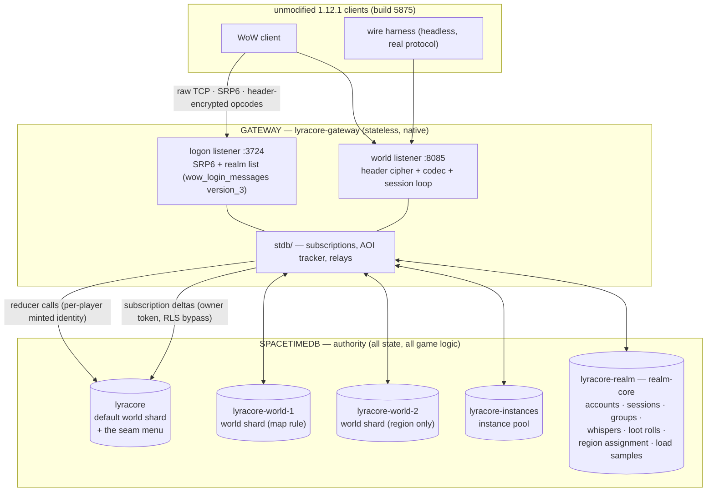

# LyraCore architecture

**Status:** current — verified against the tree on 2026-08-04. Every claim below cites the file
that makes it true; where an older document disagreed with the code, the code won.

**Authority note:** [`danger-zones.md`](./danger-zones.md) is authoritative over this document and
over every other document in this directory for anything about migrations, publishing, or the
deploy/verify procedure. This page explains *what the system is*; `danger-zones.md` tells you *what
will bite you*.

---

## 1. The shape of the system in one page

LyraCore serves **unmodified World of Warcraft 1.12.1 clients (build 5875)**. It is two tiers and
one rule.

| Tier | What it is | What it owns |
|---|---|---|
| **SpacetimeDB module** (`module/`, crate `lyracore-module`, compiles to wasm) | Relational tables + reducers | **All durable game state and essentially all game logic.** |
| **Gateway** (`gateway/`, crate + binary `lyracore-gateway`, native) | The 1.12.1 wire protocol, both listeners, the SpacetimeDB client | **No durable game state.** Protocol framing, ciphers, codecs, routing, and the cross-database gates the module structurally cannot answer. |

The rule: **a client never speaks SpacetimeDB.** A 1.12.1 client speaks SRP6 + TCP + WoW opcodes,
so the gateway is the only legitimate SpacetimeDB client, and every mutation the world can undergo
is a reducer call.



Five databases, one gateway tier, one wasm.

The same wasm is published to **every** database. A shard is a database *name*, which is a gateway
routing fact; module game logic never reads one, and a tripwire test fails the build if it starts to
(`no_module_game_logic_reads_a_shard_id` in `module/src/lib.rs`).

---

## 2. What runs where — the authority boundary, precisely

### 2.1 The module owns

- **Every durable table** — 159 `#[table]` declarations (150 in the core module, plus 9
  contributed by in-tree extension packages), of which 103 are `public` and 56 private. Full
  inventory is covered in depth in the maintainers' internal docs; §4 below is the summary.
- **Every state transition** — 240 `#[reducer]` functions in the core module (116 of them in a
  default build, the rest behind the `debug_reducers` feature), plus more from any installed
  extension package.
- **All periodic work** — 10 scheduled tables drive combat swings, creature AI, aura ticks, ground
  areas, instance reaping, transfer reaping, and event GC. Nothing on a gateway timer decides
  gameplay.
- **All authorization of writes** — a reducer derives its actor from `ctx.sender`.

### 2.2 The gateway owns

- **Socket IO and protocol state only.** Per-connection: the SRP6 scratch, the header-cipher
  counters, the current character guid, the set of guids already `CREATE_OBJECT`'d to this client,
  the issued server seed. All of it is reconstructable on reconnect; none of it is game state.
- **Encoding and decoding.** `wow_login_messages` (`version_3` for 5875) on the logon port,
  `wow_world_messages::vanilla` on the world port, plus one hand-rolled UpdateMask encoder where
  gtker 0.3's builder walls the descriptor setters.
- **Routing across databases.** Which database owns this position, which database holds this
  character, and the seven-step transfer driver. See §6.
- **The subscription plane** — the AOI tracker and every `on_insert` relay that turns a table delta
  into an SMSG. See §5.

### 2.3 The honest exception: gates that live in the gateway

The slogan "no game logic in the gateway" is true of *state*, and very nearly true of *logic* — but
not perfectly, and the exceptions are structural rather than accidental. A module reducer runs
inside one database and cannot read another. So a handful of gates that are logically module rules
are answered by the gateway, which is the only component that can see the whole realm:

| Gate | Why it cannot live in the module | Where |
|---|---|---|
| "does this character exist" / "is this character online" for party invites | realm-core holds no characters and no live entities; one world shard sees only its own | `gateway/src/world/party.rs` (`presence`, `live_anywhere`) |
| whisper target resolution by name, realm-wide, plus the ignore verdict | same | `party.rs` (`resolve_by_name`), `gateway/src/world/whisper.rs` (`ignored_anywhere`) |
| `CMSG_NAME_QUERY` resolution | same | `party.rs` (`character_anywhere`) |
| loot-roll promotion and settlement fan-out across shards | a kill's transaction cannot reach realm-core | `gateway/src/world/loot.rs` |

Each of these re-implements *the read the module gate performed*, not a new rule, and each returns
the module's own error strings so the client sees identical behaviour on a single-database
deployment. The rationale is recorded in the maintainers' internal security analysis.

---

## 3. The realm is several databases

### 3.1 Today's topology

The realm runs as **five SpacetimeDB databases** behind one gateway tier:

| Database | Role |
|---|---|
| `lyracore` | default database + world shard (also the shard the seam menu is read from) |
| `lyracore-world-1` | world shard (map 1, Kalimdor) |
| `lyracore-world-2` | world shard reached only through a **region assignment**, never a map rule |
| `lyracore-instances` | instance pool (map 36 / Deadmines and friends) |
| `lyracore-realm` | realm-core: accounts, sessions, groups, whispers, loot rolls, region assignments, load samples |

The **local developer fixture is its own, smaller topology** — since #327 four databases
(`lyracore`, `lyracore-elwynn`, `lyracore-kalimdor`, `lyracore-realm`) with two live seams,
brought up by `./lyracore dev up`; `dev up --single` collapses it to one. It is not a cut-down
version of the five above and does not share their names — see
[`development-cli.md`](./development-cli.md) §"Sharded out of the box, on purpose".

**Direction:** the alpha realm targets **at most one shard per zone**, with capital cities on their
own shards, and the ops tooling generalized off the hard-coded five. The tooling generalization and
the terrain-derived seam-menu *generation* (#248) are not built, and a capital-on-its-own-shard split
is not yet statable — the repository holds no capital's extents, which is one of the things #248
would supply. The *shape* has shipped as hand-drawn content data anchored on committed coordinates:
`content/regions/fixture.regions`, the fixture realm's Northshire Valley | rest-of-Elwynn seam
([`region-sharding.md`](./region-sharding.md) §"The shipped fixture menu").

⚠ **All five databases run on one SpacetimeDB node, and that is a licensing constraint as well as a
deployment fact.** Seven `spacetimedb-*` crates are BSL-1.1, whose Additional Use Grant permits
production use with "no more than one SpacetimeDB instance". Five *databases* on one *instance* stays
inside it. Standing up additional SpacetimeDB instances to scale past one node — or running the
module on behalf of third parties — falls outside that reading and needs a fresh licence review
before it ships.

### 3.2 The configuration is entirely environment variables, and they fail silently

This is the single sharpest edge in operating LyraCore. The topology lives nowhere but the
gateway's environment. Omit one and you get a **working-looking single-database gateway**.

| Variable | Controls | Default if unset | Failure mode |
|---|---|---|---|
| `LYRACORE_SHARD_MAP` | `(map, bucket) → database` routing rules | `""` → one database | **Silent.** No Kalimdor, no instance pool. |
| `LYRACORE_SHARD_MAP_FILE` | file fallback for the above (the env var wins) | unset | unreadable file logs an error, then single shard |
| `LYRACORE_REALM_CORE` | the auth / session / character-index database | `None` | **Silent.** Auth, parties and whispers fall back to the world database. |
| `LYRACORE_REGION_SHARDS` | extra connected world shards no rule routes to | `""` | **Silent.** Region routing switches itself off. |
| `LYRACORE_COORDINATOR_TOKEN` | the owner token the coordinator connects with | `None` → anonymous | warns, then cannot read `game_account` / `game_session` |
| `LYRACORE_DATABASE` | default / home database name | `lyracore` | **Silent.** A wrong name connects cleanly to the wrong place. |
| `LYRACORE_SPACETIMEDB_URL` | node URI, also the base for `/v1/metrics` | `http://127.0.0.1:3000` | loud (connect fails) |
| `LYRACORE_LOGON_BIND` / `LYRACORE_WORLD_BIND` | listener binds | `0.0.0.0:3724` / `0.0.0.0:8085` | loud |
| `LYRACORE_AOI` | AOI-scoped subscriptions | **on** (`=0` disables) | — |
| `LYRACORE_VIEW_MERGE` | cross-seam visibility | **on** | — |
| `LYRACORE_WARM_HANDOFF` | mid-session seam handoff | **on** | — |
| `LYRACORE_QUEST_LOG` | quest-log descriptor fields | **on** | — |
| `LYRACORE_SEAM_NOTIFY` | a chat line per handoff | **on** (`=0` disables) | — |
| `LYRACORE_MAX_SESSIONS` / `LYRACORE_ADMIT_CONCURRENCY` | login-queue seat ceiling / admissions per tick | `0` = unlimited | a malformed value silently unlimits |
| `LYRACORE_LOAD_SAMPLE_SECS` | shard/region load sampling cadence | `30` | — |
| `LYRACORE_METRICS_DB_IDS` | `<shard>=<hex-identity-prefix>` map for `/v1/metrics` | `""` | warns loudly at startup; occupancy unmeasured |
| `LYRACORE_WRITER_TRACE` | per-session writer black-box ring | off | — |
| `LYRACORE_TRANSFER_ABORT_AFTER` | crash-injection harness (aborts a named transfer step) | unset | an unknown step name logs an error and nothing fires |
| `LYRACORE_PROFILE_SECS` | `--features dhat-heap` builds only | `120` | — |

Two non-`LYRACORE_` variables matter: `RUST_LOG` (consumed by `env_logger` in `gateway/src/main.rs`)
and `MALLOC_ARENA_MAX` (glibc, not the binary — worth ~4× RSS per connection).

All of the above are parsed in `gateway/src/config.rs` (the topology section, then the feature-flag
section) and `gateway/src/load_sample.rs`.

There are **no `GW_*` compatibility aliases.** Every variable carries the `LYRACORE_` prefix, and an
un-renamed one is simply unset rather than reported.

**Do not hand-roll the launch.** Use the recipe in [`danger-zones.md`](./danger-zones.md) §3
verbatim, or the `./lyracore` development CLI documented in
[`development-cli.md`](./development-cli.md).

### 3.3 Syntax of the routing variables

```bash
# rules: <map_id>:<bucket>=<database>, first match wins; `*` wildcards either side;
# `<map_id>=<db>` is shorthand for `<map_id>:*=<db>`; separators are , ; or newline; # comments.
# NOTE: open world is instance_id 0 == bucket 0, so `*:0=<db>` moves every open-world location too.
LYRACORE_SHARD_MAP="36:*=lyracore-instances, 1:*=lyracore-world-1"

# a single database name; blank, absent, or equal to LYRACORE_DATABASE all mean "unconfigured"
LYRACORE_REALM_CORE=lyracore-realm

# bare database names. The default DB, anything a rule already names, duplicates,
# and realm-core are all rejected with the reason logged.
LYRACORE_REGION_SHARDS="lyracore-world-2"
```

### 3.4 Verifying the topology came up

```
coordinator connected to shard <db>                       # gateway/src/stdb/connection.rs — per success, reliable
realm-core active: accounts, sessions, and the ...        # connection.rs
shard map active: N databases [...]                       # connection.rs — printed ONLY when N > 1
world listening on 0.0.0.0:8085                           # gateway/src/world/mod.rs — the health marker
```

⚠ Two traps in that list. `shard map active` is behind an `if conns.len() > 1` guard, so a
single-database gateway prints **no database list at all** — an empty grep result is
indistinguishable from a wrong grep pattern. And the line prints the *configured* set
(`map.databases()`), not the connected one: a shard that failed to connect is still listed, and its
failure is a separate `log::error!`. Count `coordinator connected to shard` lines to prove
connectivity.

---

## 4. The data model

Full inventory and the load-bearing row shapes are covered in depth in the maintainers' internal
docs. The summary:

- **159 tables**, `game_`-prefixed for core and `pkg_<name>_`-prefixed for packages. External gtker
  crates keep their `wow_` names and are never renamed.
- **103 public / 56 private.** `public` means "subscribable by a client connection". Private tables
  (`game_account`, `game_session`, `game_operator`, every region/transfer/instance/realm-core table)
  are readable only over the owner token.
- **16 `#[client_visibility_filter]` RLS filters**, every one of the same shape
  `SELECT * FROM <table> WHERE <identity column> = :sender`, scoping owner-private rows
  (`game_character`, `game_item_instance`, `game_player_spell`, …) and recipient-addressed events
  (`game_group_event`, `game_whisper_event`, `game_xp_event`, …).
- **Spatial partitioning is baked into the rows.** `game_world_entity` carries `grid_x`/`grid_y`
  cell columns and indexes `(map_id, instance_id, grid_x, grid_y)`; seven event/motion tables carry
  the identical 4-column grid key so an AOI box query is a range scan.

**Migration discipline** (the law is `danger-zones.md` §1.2): a new column is END-appended with
`#[default(...)]` — which **cannot** default a `String`, so string data goes in a new table — and a
new table requires regenerating the gateway bindings. Every schema change must reach **every**
shard; a partial publish presents as an unrelated mid-session hang, not a loud error.

---

## 5. The read plane: subscriptions, AOI, and relays

### 5.1 Two kinds of connection

| | Coordinator connection | Per-player connection |
|---|---|---|
| Count | one per database in the topology | one per logged-in account per shard (plus one per away shard a straddling player touches) |
| Auth | the **owner token** → bypasses RLS | **no token** → the node mints a fresh identity, bound to the account by `establish_session` |
| Created | `gateway/src/stdb/connection.rs` | `connection.rs`, cached by `Coordinator::player_conn` |
| Used for | every read (it is the cache the gateway reads through) + privileged reducers | every gameplay reducer call, so `ctx.sender` is the player |

A coordinator connection subscribes 51 literal `SELECT * FROM <table>` queries, plus 10 more when
more than one database is configured (`connection.rs`). The extra ten are conditional
because **a subscription to a table the deployed module does not have fails to apply**, which would
fail the whole gateway — so a gateway restarted before a module republish must not ask for the
sharded tables.

### 5.2 Area of interest — default on

| Fact | Value | Source |
|---|---|---|
| Cell size | 50 yd | `GRID_CELL_SIZE`, `crates/lyracore-shared/src/spatial.rs` |
| Box | 5×5 cells (`BOX_HALF_SPAN = 2`) | `BOX_HALF_SPAN`, `spatial.rs` |
| Guaranteed-visible radius | 100 yd (box spans ~250 yd; culls past ~150 yd on an axis) | `spatial.rs` doc comment on `GRID_CELL_SIZE` |
| Recenter | on map change or leaving the anchor cell — roughly every 7 s of walking | `gateway/src/stdb/aoi.rs` (`GridBox`/recenter logic) |
| Kill switch | `LYRACORE_AOI=0`; **default on since 2026-07-10** | `gateway/src/config.rs` |

Four tables ride box-scoped range subscriptions on the **per-player** connection —
`game_world_entity`, `game_gameobject`, `game_entity_motion`, `game_creature_spline` — all built by
one query builder (`table_range_query` in `gateway/src/stdb/aoi.rs`), with a source-scan test
asserting nothing bypasses it (`the_box_query_set_covers_every_box_scoped_table`). A recenter
subscribes the new rectangles first and only unsubscribes the
old handles once every new one has applied, so coverage never gaps; an error keeps the previous
coverage.

> Historical note: the original AOI design used 3×3 boxes of 533 yd cells and was default off. None
> of those numbers are current; the table above is.

### 5.3 The coordinator-relay law

Most `on_insert` relays hang off the per-player connection. A specific class of them **must not**:

> The per-player connection's AOI subscriptions churn mid-flight (subscribe-new / unsubscribe-old on
> every recenter), and a concurrent transaction's deltas folded into an in-flight apply can swallow
> an event. Observed at 100% on an instance-creating portal entry: the pair was never sent and the
> despawned player limbo'd. — documented in `gateway/src/stdb/subscriptions.rs`

So every relay carrying **stuck state** — a state the player is wedged in until the packet arrives —
is registered on the **coordinator** connection, whose subscription set is stable and whose owner
token bypasses the recipient RLS; the closure self-filters by recipient. That set is:
`game_xp_event`, `game_levelup_event`, `game_character_explored`, `game_group_event`,
`game_whisper_event`, `game_character_quest`, `game_item_instance`, `game_teleport_event`,
`game_addon_message`, `game_player_reputation`, and `game_bot_invite_intent`. The last one is
registered once at gateway startup with no session to hang it off, so it is re-armed through
`CoordinatorInner::on_reconnect` (`connection.rs`) after a watchdog swap.

Two of these ride the coordinator for a *different* reason: `game_group_event` and
`game_whisper_event` live on realm-core, and a per-player identity is minted per-database and names
nobody there.

### 5.4 RLS is not a universal backstop — state this plainly

- **Player connections are anonymous.** They connect with no token; the node mints an identity.
  Anyone who can reach the node's `:3000` port can mint one too and call any reducer that is not
  operator-gated, with exactly the footing a gateway player connection has. `ctx.sender` checks stop
  such a caller from acting as a *specific other* player; they do not stop it from acting as *some*
  player. **The model's safety rests on `:3000` being unreachable**, and nothing in this repository
  enforces that today.
- **Not every public table has an RLS filter.** `game_character_explored` is public with none: it
  has no `owner_identity` column, and all 16 deployed filters are `<identity col> = :sender`. It is
  scoped instead by the only per-player subscription in the gateway that is not `SELECT *`
  (`... WHERE character_guid = {self_guid}`, the `explored_query` in `subscriptions.rs`) plus a
  gateway-side self guard.
- **RLS validation is partial, and knowing which half matters.** Preflight's RLS-filter validation
  step checks every filter against the generated bindings and **fails** if a filter names an
  unknown table or column — so an identifier typo no longer survives to production. What preflight
  still cannot check is whether the node's RLS engine *accepts the query shape*: SpacetimeDB stores
  this SQL as raw text at schema-extraction time, and a filter it rejects fails `subscribe()` and
  breaks **every login**. Treat a new filter *shape* as a live-verification item; a renamed column is
  now caught offline.
- **The coordinator bypasses RLS by design.** It is the owner. Every read the gateway performs is
  through that cache, so RLS protects *clients of SpacetimeDB*, not the gateway from itself.

---

## 6. Sharding: regions, routing, and transfer

This is the sharding model in full: the hierarchy, routing, transfer, and cross-seam visibility.

### 6.1 The hierarchy

| Rung | What it is | Where it lives | Who reads it |
|---|---|---|---|
| **Cell** | 50 yd square | baked into every spatial row as `grid_x`/`grid_y` | module + gateway |
| **Region** | a contiguous inclusive cell rectangle, floor 10×10 cells | `game_map_region`, imported content data | gateway routing |
| **Shard** | a SpacetimeDB database | `game_region_assignment` on realm-core | **gateway routing only** |

Region definitions are **content data**, and one menu ships in this repository:
`content/regions/fixture.regions` draws the developer fixture's Northshire Valley | rest-of-Elwynn
seam (#327).

`game_region_assignment` carries a monotonic `epoch` per `(map_id, region_id)`; a flip must carry a
strictly higher epoch, and an un-assign is a tombstone (empty shard name) rather than a delete, so
the high-water mark survives and a stale retry cannot resurrect a superseded assignment
(`epoch_accepted` in `module/src/region.rs`).

### 6.2 Resolving "which database owns this position"

```
world entry:  WorldStore::settle_home_shard   (gateway/src/stdb/world_store.rs)
   1. realm-core's character→shard index — a HINT, confirmed against the shard that
      actually holds the row, self-healing on disagreement
   2. region overlay — config::resolve_region_shard (gateway/src/config.rs):
      definitions from the default world shard + assignment from realm-core + position
   3. fall-through — the (map_id, instance_id) shard map

movement:     Coordinator::region_shard_for_point  (connection.rs)
AOI split:    Coordinator::split_box_by_shard      (connection.rs)
```

Step 2 answers `None` — meaning "no region opinion, let the shard map decide" — for: any
`instance_id != 0`, region 0 (the reserved "rest of the map"), no imported definitions, no
assignment row, an empty or tombstoned shard name, and a shard the gateway never connected to.

### 6.3 A seam crossing, end to end

Every movement packet drives the AOI update and then a seam check (`seam_check`, called from
`forward_movement` in `gateway/src/world/mod.rs`). The check confirms only on the **second
consecutive** foreign cell (hysteresis, `gateway/src/world/seam.rs`), skips while the player is in
combat, and honours a 5 s per-session cooldown. When it fires, `run_transfer`
(`gateway/src/world/transfer.rs`) drives seven steps:

| # | Gateway | Module reducer (`module/src/`) |
|---|---|---|
| 1 | `src.begin_transfer(plan)` — writes the escrow row, deletes the live entity | `transfer.rs` (`begin_transfer`) |
| 2 | `dst.ensure_instance(...)` (only when the destination is an instance) | `instance.rs` (`ensure_instance`) |
| 3 | `dst.import_character_blob(id, blob)` | `transfer.rs` (`import_character_blob`) |
| 4 | `src.confirm_import(id)` | `transfer.rs` (`confirm_import`) |
| 5 | `src.finish_transfer(id)` — **delete last** | `transfer.rs` (`finish_transfer`) |
| 5b | publish the character→shard index to realm-core | `realm_core.rs` |
| 6 | `dst.release_transfer(id)` — the arrival fence drops | `transfer.rs` (`release_transfer`) |
| 7 | `src.evict_instance_population(...)` — best effort, never fails the hop | `instance.rs` (`evict_instance_population`) |

**The escrow row on disk is the authority**, and the transfer id **is** the character guid
(`transfer_id_for` in `gateway/src/world/transfer.rs`) so recovery needs nothing from gateway RAM.
While either escrow row exists the character is *in transit*, and four chokepoints refuse to act on
it: `helpers::entity_by_owner`, `world::player_login`, `begin_transfer`'s own target-side delete, and
`helpers::character_by_guid`/`character_by_name` (checked in `module/src/transfer.rs`). A scheduled
reaper sweeps abandoned escrows every 5 s. `LYRACORE_TRANSFER_ABORT_AFTER=<step>` injects a crash
after any named step for testing.

Afterwards the gateway re-pins the session: new home handle, `bind_shard_session`, a fresh
`player_login`, a fresh subscription set, then it replays the movement it queued during the hop.
The player sees **no loading screen**.

### 6.4 Cross-seam visibility — built, on by default

Seeing players on the far side of a seam is implemented and enabled (`LYRACORE_VIEW_MERGE`, default
on). A straddling 5×5 box is decomposed by `aoi::split_box_by_shard` (`gateway/src/stdb/aoi.rs`)
into the fewest rectangles that agree with the per-cell resolver — and because a region floors at
10×10 cells while the box is 5 wide, a box straddles at most one boundary per axis, so no shard ever
needs more than two rectangles. Each shard's share is one subscription handle carrying the same four
range queries, on that shard's own per-account connection.

The away shard's connection is opened on a **background thread**; until it resolves, that shard's
rectangles are simply not subscribed this recenter. The degrade is "the far side pops in late",
never a stall on the player's own packet processing.

The away leg registers a deliberately narrower relay set (entity create/destroy/values, gameobject,
motion, creature splines, chat, emote — never self-owned state) sharing the home leg's dedup sets,
so a peer crosses the socket exactly once. The stealth gate reads the candidate's own aura rows on
the away shard's cache; the ghost gate mirrors the *viewer's* flag through a small atomic
(`ViewerGates` in `aoi.rs`). Chat and emotes cross a seam. Buffs and intents, and melee and trade
co-location, do not; AoE clips at the seam, by spec.

> Historical note: the *first* attempt at this was built on per-cell subscriptions, and both were
> reverted after measurement showed that a per-cell equality query costs more to register than a
> whole-box range costs to evaluate. The current code is a rebuild on range sub-boxes.

### 6.5 Deciding when to draw a seam

A background task samples every connected shard's writer occupancy (from each node's `/v1/metrics`),
its live session count, and per-region population every `LYRACORE_LOAD_SAMPLE_SECS` (default 30 s),
and writes them to realm-core as `game_shard_load` / `game_region_load`. Both are ring buffers of
the last 20 samples per key — about ten minutes of history, which is what distinguishes sustained
load from a spike. Two `spacetime sql` queries against realm-core's `game_shard_load` and
`game_region_load` tables answer "which shard is hot" and "which region is the busy part of it".

---

## 7. Extending the server: packages

A package is a self-contained folder of Rust source, discovered by `module/build.rs` at build time
and codegenned into the module crate under a `pkg_<name>` prefix. Enabling a package is the folder
existing; disabling is deleting it and republishing. The example packages that exist in the
maintainers' tree — the playerbots simulation among them — are maintainer-side and are not part of
this repository.

**Tier-1 packages are trusted compiled module code, not sandboxed code.** A package's Rust compiles
into the same wasm and runs with full module privileges and an unrestricted `&ReducerContext`.
`ctx.sender` gates a reducer's *entry*, not a package's table access once inside: one of the
maintainer-side packages writes other guids' entities directly, and nothing stops it. Installing a
package is therefore equivalent to accepting a patch to the server, and should be reviewed as one.
The WASM sandbox around the module is a determinism and blast-radius property, not a safety
guarantee about what a package may touch — safe untrusted modding is **not** built.

Four `build.rs` text-scanned registry markers are the extension points — `character_owned!(delete |
restamp | transfer, …)`, `game_tick_pass!`, and `game_hook!(<event>, …)`. A malformed marker or an
unknown hook event fails the build loudly. Mutating/decorator hooks, a Lua script host, and a
data-patch layer are explicitly **not** built.

---

## 8. Verification

The ladder, and the rule that no rung substitutes for another:

> unit-test green **is not** suite green **is not** played green **is not** measured green.

| Rung | Tool | Catches |
|---|---|---|
| Unit / integration | `cargo test --workspace` | logic, planners, codec round-trips, and the source-scan tripwires |
| Deploy shape | `lyracore preflight` — the repo's `./lyracore` CLI shim, fully offline | schema and `#[default(...)]` encoding breaks no test can see |
| Server state | `spacetime sql` | did the transaction actually do it |
| Wire | the pinned wire-protocol test suite — the real 5875 protocol, no wine (maintainer tooling, not in this repository) | did the server send the right packet |
| Client | a real 5875 client | visual residue only |
| Measurement | the maintainers' capacity benchmark + `/v1/metrics` | does it hold up under load |

**Live wire tests against a running stack are operator-gated in attended sessions.** Offline tests
are unrestricted.

The build carries source-scan tripwire tests that fail on architectural drift rather than on
behaviour, all in `module/src/lib.rs`: no module code outside `region.rs`/`load.rs` may read a shard
id (`:760`); no whole-table `.iter()` over a spatial table outside a shrinking whitelist (`:617`);
every character-keyed table must carry `character_owned!` markers (`:386`); character lookups must
go through the two chokepoint helpers (`:945`). Each has a companion ratchet test that fails when
its whitelist names something that no longer needs to be there.

**Debug reducers are compiled out by default.** `module/Cargo.toml` declares
`debug_reducers = []` with no `default`, and `module/src/debug.rs` is `#![cfg(feature =
"debug_reducers")]` in its entirety. A debug build adds 124 reducers (109 in `debug.rs`, 15 more
gated individually elsewhere — one `#[cfg(feature = "debug_reducers")]` per function — across ten
other files, including the not-obviously-named `set_guid_floor` in `auth.rs`; `grep -rn
'cfg(feature = "debug_reducers")' module/src` finds every one of them. A production build must be a
plain build; the deploy wrapper `lyracore publish` enables the feature deliberately because the
local test harness needs it.

---

## 9. Document index

### Architecture and internals — start here

| Document | What it is |
|---|---|
| **`architecture.md`** (this file) | The current system: tiers, topology, data model, read plane, sharding, packages. |
| [`danger-zones.md`](./danger-zones.md) | **Authoritative.** Traps, tooling gotchas, and the exact deploy/verify procedure. Read before any engine change. |
| [`schema.md`](./schema.md) | The table-level data model. |
| [`region-sharding.md`](./region-sharding.md) | How the realm is split across databases and how a character crosses a seam. |

### Operating and building

| Document | What it is |
|---|---|
| [`quickstart.md`](./quickstart.md) | The shortest path from a clean checkout to a running realm. |
| [`development-cli.md`](./development-cli.md) | The `./lyracore` CLI: the pinned shim, and the build, preflight, publish and local-stack commands. |
| [`data-ingestion.md`](./data-ingestion.md) | Where vanilla content comes from and the licensing firewall. |

**The work queue is GitHub Issues**, which is the single source of truth for what is open.
